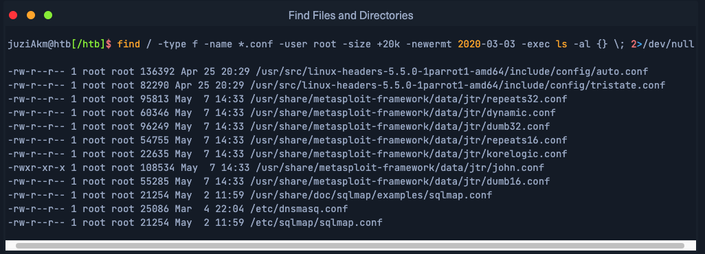

# Learning Dependecies

## 21st November 2024
Today, I learned about **Linux**, **Windows OS**, and **Virtual Private Server**. How to install them and make basic configurations. 

### Key Takeaways
- **Linux Navigation**: At first was a personal project started in 1991 by a finnish student Linus Torvalds.
- **Working with files and directories**: Available in over 600 distributions.
  

### Reflections
## Linux Navigation
Main commands to navigate in Linux:
-  *pwd* - where am I;
-  *ls* - to list all the contents inside a directory;
to display more information about directories and file I can use an option:
-  *ls -l* - First, we see the total amount of blocks (1024-byte - 1 block) used by the files and directories listed in the current directory, also we see type and permissions, number of hard links to the file/directory, owner, group owner, size or number of blocks, date and time, and finally directory name.
-  *ls -la* - to list all files of a directory, including hidden files that start with a dot at the beginning of its name. 
-  *cd* - we can navigate to the directory and specify the path by adding the path to the specific directory, for instance: cd /dev/shm;
-  *cd -* - to get back to the home directory;
-  *cd /dev/s [TAB x2]* - if I type cd /dev/s and press *TAB* twice it will return all entries with the letter *s* in the directory of /dev/;
-  *cd ..* - to jump to the parent directory, 1 level up in the directory hierarchy;
-  *touch* - to create a file;
-  *mkdir* - to create a directory;
-  *mkdir -p* - to create parent directories;
-  *tree* - to see the whole structure of directories;
-  *touch ./users/tom/readme.txt* - create readme.txt inside tom dir, fram home directory;
-  *mv* - move or rename files and dirs;
-  *rm* - remove files;
-  *rm -r* - remove not empty directory;
-  *rmdir* - remove directory;
-  *nano* file.txt - create text file in Nano editor;
-  *cat* file.txt - to view the contents of the file;  
-  *which* - to return the path to the file or link that should be executed;
-  *find* - to find files and folders, I can use options to define search by parameters: 

 
And here is an explonation of parameters:

-  *locate* - to return file or folders quicker through the system;
-  *find* |wc -l - to count the total number of obtained results;  
-  *find* 2> /dev/null - to redirect the resulting errors to the "null device", which discard all data;
-  *find* 2> /dev/null > file.txt - to redirect standard result to file.txt without resulting errors;
-  *find* 2> stderr.txt 1> stdout.txt - to direct STDOUT ot stdout file, and all resulting error files to STDERR;
-  *ls | grep* ".txt" - in this case ls lists files, and its output is sent to `grep`, which filters for `.txt` files. 
-  *more*
-  *less*
-  *head*
-  *tail*
-  *sort*
-  *grep -v*
-  *cut*
-  *tr*
-  *column*
-  *awk*
-  *sed*
-  *wc*

**Practical Excersices** 
1. Used this command to resolve the problem: 
`find / -type f -name *.conf -size +25k -size -28k -newermt 2020-03-03 2>/dev/null` 
2. How many total packages are installed on the target system?
`dpkg -l | grep -c '^ii'`
3. How many files exist on the system that have the ".log" file extension?
`find / -type f -name *.log 2> /dev/null |wc -l`
